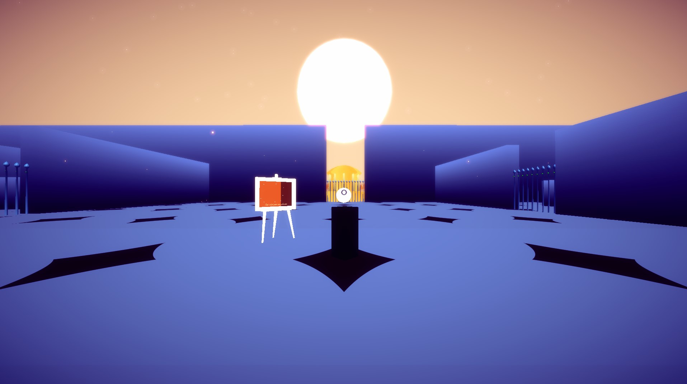
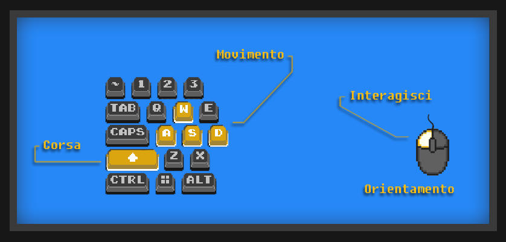
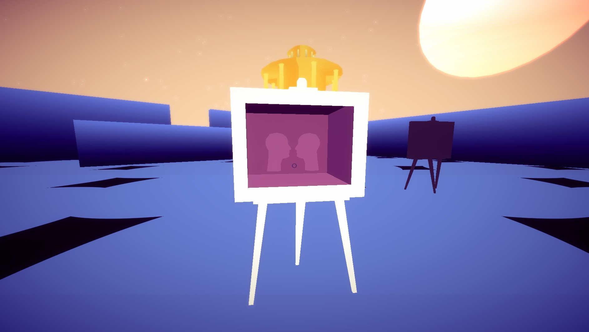
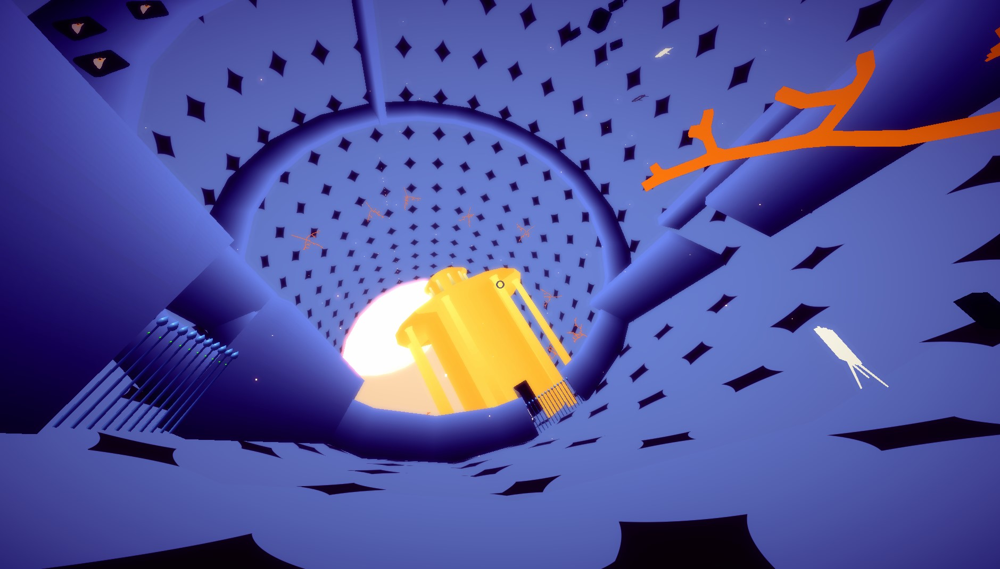

# USER MANUAL

## Starting the game

Once the application is launched, use the mouse to click on the *Start* button.

The user will find themselves in a three-dimensional gaming environment where they can move and interact using the mouse and keyboard. The viewpoint will be first-person. 

||
|:--:|
| *how the game appears from the first scenario* |

### Controls

| Action | Input |
|--|--|
| rotate camera | mouse move |
| interact | mouse left-click |
| move | W A S D |
| run | Shift (hold) |
| pause | M or P |

## Gameplay

The game is set in a surreal environment and features a variety of *puzzles*.

The players are invited to explore the surroundings at their own pace; interpret it, find puzzles and seek their solutions.

||
|:--:|
| *puzzles are represented by **white frames**; place a **white object** inside to complete the composition* |

Upon solving each puzzle, the terrain will alter. Its new topological properties will allow access to new areas, previously inaccessible.

||
|:--:|
| *the topology of the cylinder may now allow you to reach the other side of a wall* |

These new areas will contain new puzzles to solve, and so forth.

The final area of the game corresponds to the opposite side of the initial game surface and will only be reachable when the terrain takes the form of a **Moebius strip**.

Once the puzzle in this area is solved, the player will see an end-game screen. From here, they can return to the main menu by clicking the button *Menu*.
