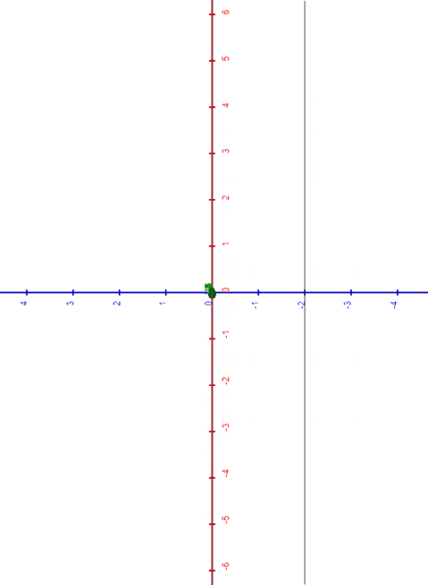
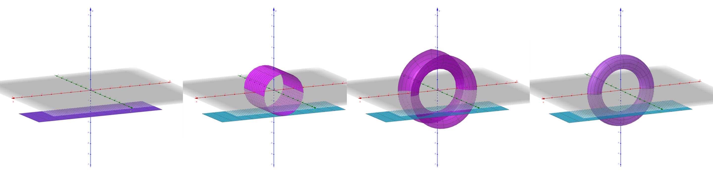
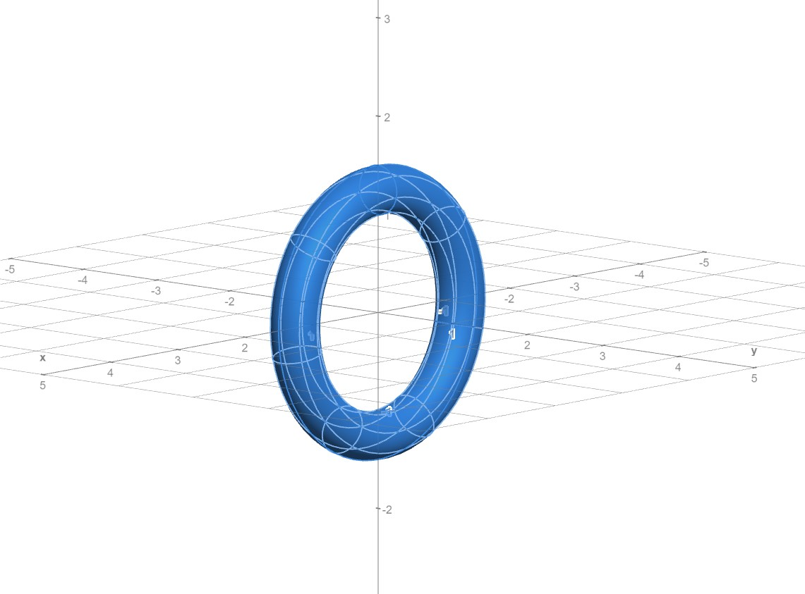
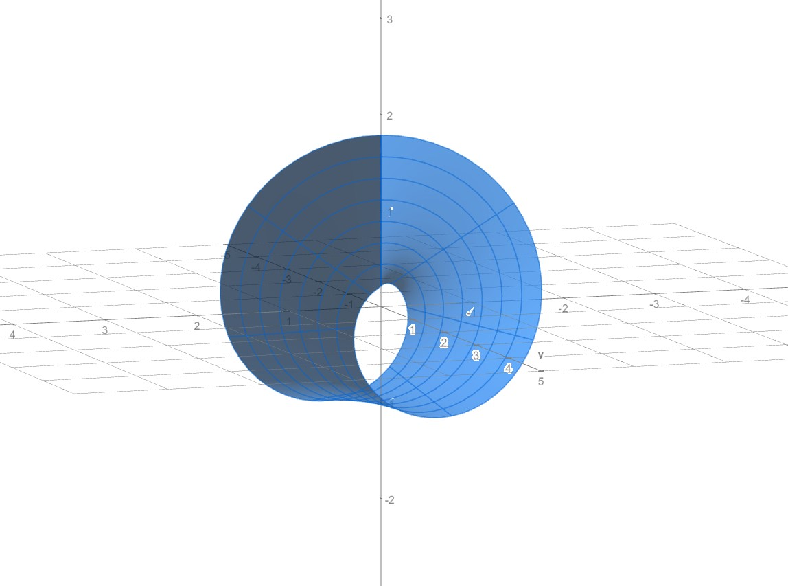

# THEORY

## TRANSITION EFFECT BETWEEN DIFFERENT SURFACES

One of the keypoints of this project is the ability to transform one surface into another in a way that the animation appears natural and minimizes local distortions as much as possible.

The most plausible transitions are those between Plane and Cylinder, and between Cylinder and Torus.

These animations have been created with a common principle, which we can more easily see in the following two-dimensional case.

### Transition from a circle to a line segment in $\mathbb{R}^2$

Consider a circle with radius $R_0$ and centered at the origin.

Our intention is to *unwrap* this circle, opening it up and stretching it naturally until it becomes a line segment, as illustrated in the figure:

||
|:--:|
| *from circle to line* |

In other words, we want to increase the radius of our circle while discarding a wider arc to preserve the length of the curve.

Let's parameterize the circle using polar coordinates, with $\rho >0$ and $\theta\in (-\pi,\pi)$
$$
\mathbf{c}(\rho,\theta) = (\rho cos \theta , \rho sin \theta).
$$

For $\rho = R_0$, we have our initial circle, while for $\rho \to +\infty$, the curvature $k = \frac{1}{\rho}$ will decrease, tending to $0$.

For $\rho > R_0$, we also want to reduce the represented sector of the circle. This reduction should occur in such a way that $\theta \propto \frac{R_0}{\rho}$.

Let's then take $\theta = \alpha \frac{R_0}{\rho} = \alpha R_0 k$, where $\alpha \in (-\pi, \pi)$.

We can rewrite the circle in terms of the curvature $k$ and the angle $\alpha$

$\mathbf{c}:$
$\begin{cases}
{x = \rho cos\theta = \frac{1}{k} cos(\alpha R_0 k)}\\
{y = \rho sin\theta = \frac{1}{k} sin(\alpha R_0 k)}
\end{cases}$

As an additional constraint, let's shift our curve along the x-axis as it transforms, ensuring that its point $\mathbf{c}(\rho,0)$ remains in position while the radius varies.

To achieve this, we need to compensate with a translation on the $x$ coordinate equal to $R_0 - \rho = R_0 - \frac{1}{k}$.

So, our function becomes:

$\mathbf{c}:$
$\begin{cases}
{x(k,\alpha) = \frac{1}{k} cos(\alpha R_0 k) + R_0-\frac{1}{k} }\\
{y(k,\alpha) = \frac{1}{k} sin(\alpha R_0 k) }
\end{cases}$

||
|:--:|
| *circle morphing into segment, and viceversa* |

#### A computational solution
Now, we want to simplify the function and, if possible, get rid of the value $1/k$, which becomes computationally inconvenient when $k \to 0$.

A practical solution is to use the polynomial given by the Taylor-McLaurin series expansion, in order to approximate the functions $cos(\alpha R_0 k)$ and $sin(\alpha R_0 k)$ in a neighborhood of $\theta = \alpha R_0 k = 0$.

Let's stop at the fourth degree, for example:

* $cos(\alpha R_0 k) = 1 - \frac{(\alpha R_0)^2}{2}k^2 + \frac{(\alpha R_0)^4}{24}k^4 + ...$
* $sin(\alpha R_0 k) = \alpha R_0 k - \frac{(\alpha R_0)^3}{6}k^3 + ...$

Substituting the obtained values into our function, we get:

$\mathbf{c}:$
$\begin{cases}
{x(k,\alpha) = R_0 -\frac{(\alpha R_0)^2}{2}k + \frac{(\alpha R_0)^4}{24}k^3 }\\
{y(k,\alpha) = \alpha R_0 - \frac{(\alpha R_0)^3}{6}k^2 }
\end{cases}$

This function doesn't present issues for $k=0$, and it's noticeable how in this case it becomes:

$\mathbf{c}(0,\alpha)=(R_0, \alpha R_0)$ for $\alpha \in (-\pi,\pi)$

This is exactly the line segment passing through $(R_0, 0)$, parallel to the y-axis, and with a length of $2\pi R_0$, which is equal to the length of the initial circle.

### Transition from Plane to Cylinder

Let's set $t = k R_0$, then for $k \in [0, \frac{1}{R_0}]$, we have $t \in [0, 1]$.

Using a similar approach to what we've seen for the case of the segment-circle, we can parametrize a surface that, varying with $t$, allows us to transition from a portion of a rectangular plane to a cylinder, and vice versa.

For compactness, let's denote $\alpha$ as the angle in terms of $u \in (-0.5, 0.5)$ such that we can write $\alpha = 2\pi u \in (-\pi, \pi)$.

Thus, we obtain the function:

$C_t(u,v):$
$\begin{cases}
{x= \frac{R_0}{t} \sin(t\alpha)}\\
{y= W v }\\
{z= \frac{R_0}{t} (1-t-\cos(t\alpha))}
\end{cases}$

for $t\in [0,1]$ and $u,v \in (-0.5,0.5)$

Where $R_0 > 0$ is the radius of the fully enclosed cylinder, $W > 0$ its height along the $y$-axis.

Again, we can use Taylor polynomials to replace the *sine* and *cosine* functions, getting rid of $t$ in the denominator. We'll obtain:

$C:$
$\begin{cases}
{x= R_0 (\alpha - \frac{\alpha^3}{6}t^2 + \frac{\alpha^5}{120}t^4 + o(t^6))}\\
{y= W v }\\
{z= -R_0 (1 - \frac{\alpha^2}{2}t + \frac{\alpha^4}{24}t^3 - \frac{\alpha^6}{720}t^5 + o(t^7))}
\end{cases}$

### Transition from Cylinder to Torus

Building upon the previous case, we now want to allow the lateral surface of the cylinder to *"roll up"* radially until it closes into a torus.

Let's consider a parameter $s \in [0, 1]$ such that $s = k_T r_0$, where $r_0$ is the minor radius of the desired torus and $k_T$ is the normal curvature of the torus relative to any plane that radially intersects it. The angles of the major and minor circles of the torus will be expressed as $\alpha(u) = 2 \pi u$ and $\beta(v) = 2 \pi v$, respectively.

$T_{t,s}(u,v):$
$\begin{cases}
{x= \frac{R_0}{t} \sin(t\alpha) + \frac{r_0}{s} (1-cos(s\beta))\sin(t\alpha)}\\
{y= \frac{r_0}{s} sin(s\beta)}\\
{z= \frac{R_0}{t} (1-t-\cos(t\alpha)) - \frac{r_0}{s}(1 - cos(s\beta)) cos(t\alpha)}
\end{cases}$

for $t,s\in [0,1]$.

Similarly to what we did for the cylinder C, it's also possible in this case to use Taylor polynomials and get rid of the divisions by $t$ and by $s$.

* $\frac{r_0}{s} (1-cos(s\beta)) = -r_0(-\frac{\beta^2}{2}s + \frac{\beta^4}{24}s^3 - \frac{\beta^6}{720}s^5 + o(s^7))$
* $\frac{r_0}{s} sin(s\beta) = r_0(\beta - \frac{\beta^3}{6}s^2 + \frac{\beta^5}{120}s^4 - \frac{\beta^7}{5040}s^6 + o(s^8))$

Taking the polynomials (here truncated for space reasons) at the desired degree, we can obtain the form:

$T:$
$\begin{cases}
{x= (R_0 - t r_0 (-\frac{\beta^2}{2}s + \frac{\beta^4}{24}s^3 - ...) )(\alpha - \frac{\alpha^3}{6}t^2 + \frac{\alpha^5}{120}t^4 - ...)}\\
{y= r_0(\beta - \frac{\beta^3}{6}s^2 + \frac{\beta^5}{120}s^4 -...)}\\
{z= -R_0 (1 - \frac{\alpha^2}{2}t + \frac{\alpha^4}{24}t^3 - ...) + r_0 (-\frac{\beta^2}{2}s + \frac{\beta^4}{24}s^3 - ...) (1 - \frac{\alpha^2}{2}t^2 + \frac{\alpha^4}{24}t^4 - ...)}
\end{cases}$

In this way, we have obtained a parametric function that allows us to represent, varying with $t$ and $s$:

* $t \simeq 0$ and $s \simeq 0$: our rectangular portion of plane **P**
* $t = 1$ and $s \simeq 0$: our cylinder **C**
* $t = 1$ and $s = 1$: our torus **T**

## Definitions

Let $\mathbf{s}$ be a function of two real variables in three-dimensional space,
$$
{\mathbf{s} :A\to \mathbb {R} ^{3}},
$$
with $A \subseteq \mathbb {R}^{2}$ chosen appropriately so that it is homeomorphic to an open disk.

Usually, for practical purposes, the domain is restricted to the unit square given by points $(u,v) \in [0,1]\times[0,1]$.

Since $\mathbf{s}$ is a vector function, it's convenient to define its coordinates $x(u,v), y(u,v), z(u,v)$ with $(u,v) \in A$, which are scalar functions such that $$\mathbf{s}(u,v) = (x(u,v),y(u,v),z(u,v)).$$

This object is also referred to as a *parametric surface* because the coordinates of each point depend on the parameters $u, v$.

The support of $\mathbf{s}$, namely $Img(\mathbf{s})$, is what is commonly referred to as a "surface".

### Partial Derivatives

Given a function $f(u,v)$, we will denote its partial derivatives with respect to the arguments $u$ and $v$ as $f_u(u,v)$ and $f_v(u,v)$, respectively. In the case of a vector function $\mathbf{g}(u,v)$, we will use the same notation, indicating the vectors of partial derivatives as $\mathbf{g}_u$ and $\mathbf{g}_v$.

### Simple surfaces

A vector function ${\mathbf{s}=\mathbf{s}(u,v)}$, 
where ${\textbf{s}:A\subseteq\mathbb{R}^{2} \to \mathbb{R}^{3}}$,
is a *simple surface* if:

1. $\mathbf{s}$ is injective in $A$;
2. $\mathbf{s} \in C^1(A)$;
3. the matrix $D_{\mathbf{s}}$ = $\begin{bmatrix}
x_{u}(u,v) & x_{v}(u,v) \\
y_{u}(u,v) & y_{v}(u,v) \\
z_{u}(u,v) & z_{v}(u,v)
\end{bmatrix}$ has full rank $\forall (u,v) \in A$.

The matrix $D_{\mathbf{s}}$ is called the *Jacobian matrix* of $\mathbf{s}$; its columns are formed by the partial derivatives $\mathbf{s}_{u}(u,v)$ and $\mathbf{s}_{v}(u,v)$.

### Normal Vector

Condition (3) in the definition of a regular surface is equivalent to verifying that, for every point in $A$, the vectors $\mathbf{s}{u}$ and $\mathbf{s}{v}$ are linearly independent. In this case, the two vectors generate a vector plane (tangent to the surface at that point), and therefore, their cross product $\mathbf{s}_u\times \mathbf{s}_v$ produces a non-zero vector normal to the surface at the given point.

Denoting by $|v|$ the Euclidean norm of a three-dimensional vector $v$, the normal vector to the surface at a point is a unit vector given by the equation
$$
\mathbf{n}(u,v) = \frac{\mathbf{s}_{u}\times\mathbf{s}_{v}}{\|\mathbf{s}_{u}\times\mathbf{s}_{v}\|}.
$$
where $\mathbf{s}_{u}\times\mathbf{s}_{v}$ is the cross product between the two partial derivatives of $\mathbf{s}$ and is given by ${\|\mathbf{s}_{u}\times\mathbf{s}_{v}\| = \|\mathbf{s}_u\|\|\mathbf{s}_{v}\|\sin\theta}$, where $\theta$ is the angle between the vectors $\mathbf{s}_{u}$ and $\mathbf{s}_{v}$.

### Curves in $\mathbb{R}^3$
A curve $\mathbf{r}$ is a vector function
$$
\mathbf{r}:I \subseteq \mathbb{R} \to \mathbb{R}^{3}
$$
where $\mathbf{r}(t) = (x(t), y(t), z(t)), t\in I$

such that $\mathbf{r}$ is continuous, meaning that each of its components is a continuous function on $I$.

A curve $\mathbf{r}:I\to \mathbb{R}^{3}$ is said to be closed if $I=[a,b]$ and $\mathbf{r}(a) = \mathbf{r}(b)$.

### Curvature and Osculating Circle of a Curve

Intuitively, at each point of a curve, curvature measures how much the curve is bent, i.e., how much the curve deviates locally from the direction given by the tangent at that point.

Given a regular curve $\mathbf{r}(t) = (x(t), y(t), z(t))$ with $t\in I$, we can always define a scalar function $k:I \subseteq \mathbb{R} \to \mathbb{R}$ such that
$$
k(t) = \frac{\| \mathbf{r}'(t) \times \mathbf{r}''(t) \|}{\| \mathbf{r}'(t) \|^3}
$$
This is called the *curvature* and represents the rate of change of the tangent vector of the curve with respect to $t$.

One way to visualize curvature is to use the *osculating circle*, which, informally defined, is the circle that best approximates the curve at a given point $\mathbf{r}(t)$.
We can then define the curvature as the reciprocal of the radius $\rho$ of this circle.
$$
k(t) = \frac{1}{\rho(t)}
$$

### Orientable Surface

A regular surface $S$ is called *orientable* if, for every closed curve lying on the surface, parameterized by $\textbf{r}:[a,b]\to S$, it holds that
$$
\lim_{t \to b^{-}} \mathbf{n}(\textbf{r}(t)) = \mathbf{n}(\textbf{r}(a))
$$
where $\mathbf{n}$ is the normal vector of $S$.

### Surfaces of revolution

Let $\gamma$ be a simple and regular curve on the $xz$ plane, given by the following parameterization:

$\gamma(t):$
$\begin{cases}
    {x=f(t)}\\
    {z=h(t)}
\end{cases}$
, $t \in (a,b)$

and such that it does not intersect the $z$-axis.

By rotating this curve around the $z$-axis, we obtain a rotational surface in $\mathbb{R}^3$ given by the following parameterization:

$S(t,\theta)$ :
$\begin{cases}
    {x=f(t)cos(\theta)}\\
    {y=f(t)}sin(\theta)\\
    {z=h(t)}
\end{cases}$

where $\theta \in (0,2\pi)$ , $t \in (a,b)$.

Such a surface is called *surface of revolution*.

Similarly, it is possible to define rotational sheets that have the $x$-axis or the $y$-axis as the axis of symmetry.

### Curvature of a Surface of Revolution

The study of surfaces of revolution is facilitated by the fact that they possess radial symmetry. Indeed, it is sufficient to consider exclusively the behavior of the curve being rotated, which will be precisely a *normal section curve* for the generated surface.

Let $\gamma$ be the curve defined below, and let $k(t)$ be its curvature function.

$\gamma(t):$
$\begin{cases}
    {x=f(t)}\\
    {z=h(t)}
\end{cases}$
, $t \in [a,b]$

Then, for analyzing the points of the rotational sheet generated from it, it will be sufficient to evaluate the product:
$$
K = k(t)h'(t)
$$

* **Elliptic points** are those for which $K>0$, thus where $k>0$ and $h'>0$ or where $k<0$ and $h'<0$.
* **Parabolic points**, whether they are maxima or minima, are those for which $K=0$, hence $h'=0$ or $k=0$.
* **Hyperbolic points** are those for which $K<0$, thus where $k>0$ and $h'>0$ or where $k<0$ and $h'<0$.

## Surfaces implemented in the project

The following are the reference parameterizations used for the various surfaces implemented in the project.

Since one of the goals was to create transition animations from one surface to another while keeping the connectivity of the polygonal mesh unchanged and only varying the positions of the vertices, the same parameter domain was chosen for all surfaces, which will not be repeated.

Therefore, please note that, for each surface, every point $$(u, v) \in (-0.5, 0.5) \times (-0.5, 0.5)$$

### Plane

Rectangular portion of a horizontal plane, parallel to the $xy$ plane, defined by the parameterization

$P:$
$\begin{cases}
    {x=L u}\\
    {y=W v}\\
    {z=Q}
\end{cases}$

where $L, W, Q \in \mathbb{R}$.

The rectangle will thus have a length of $L$, a width of $W$, and an altitude of $Q$.

### Cylinder

Lateral surface of a cylinder, having the y-axis as its axis of symmetry; it is given by the following parameterization

$C:$
$\begin{cases}
{x= \rho \sin(2\pi u)}\\
{y= W v }\\
{z= -\rho \cos(2\pi u)}
\end{cases}$

where $W,\rho > 0$.

The cylinder has a radius $\rho$ and a length $W$.

We can also view it as the surface of revolution generated by the curve $r(v) = (\rho, Wv, 0)$ revolving around the y-axis.

### Torus

The torus is a surface given by the parameterization

$T:$
$\begin{cases}
{x= (\tau \cos(2\pi v) + \rho) \sin(2\pi u)}\\
{y= \tau \sin(2\pi v)}\\
{z= -(\tau \cos(2\pi v) + \rho) \cos(2\pi u)}
\end{cases}$

where $0 < \tau < \rho$.

In this form, the torus has an axis of symmetry coinciding with the y-axis and can be seen as the surface obtained by the complete rotation around this axis of a circle lying in the xy-plane, with center $(\rho, 0, 0)$ and radius $\tau$.

### Möbius strip

The Möbius strip is a non-orientable surface, consisting of a single face and a single edge; here we will use the following parameterization

$M:$
$\begin{cases}
{x= (-Wv\sin(\pi u) + \rho) \sin(2\pi u)}\\
{y= Wv \cos(\pi u)}\\
{z= -(-Wv\sin(\pi u) + \rho) \cos(2\pi u)}
\end{cases}$

where $W,\rho >0$.

The width of the strip is equal to $W$, while $\rho$ is the radius of the circle lying in the $xz$ plane, identifiable by setting $v=0$.

## Triangular Meshes

In general terms, a mesh is a set of vertices, edges, and faces that describe a polygonal object in space.

In our case, we will only consider triangular meshes, which are three-dimensional objects whose vertices are connected in groups of three, forming triangular faces. The order of the triple of vertices determines the direction of traversal of the perimeter. This direction determines the direction of the normal vector to the triangle's surface according to the right-hand rule.

||
|:--:|
| *a mesh having four vertices and two triangles* |

## Surface Sampling

To represent a surface in mesh form, it's necessary to choose a discrete sampling of its points, converting them into vertices.

Since the surfaces (plane **P**, cylinder **C**, torus **T**, Möbius strip **M**) all share the same parameters $u$ and $v$, it has been chosen to sample at constant intervals the closed unit square that contains their domain $(u, v) \in [-0.5, 0.5] \times [-0.5, 0.5]$ along the two main directions.

By doing so, we obtain samples that are discrete $(u, v)$ coordinates. These pairs will then be evaluated by the parametric function describing the surfaces, which will convert them into three-dimensional positions and assign them to the vertices of the triangular mesh.

Applying the transition effects from one surface to another, the positions of the vertices in space will vary, but the connectivity of the mesh will remain unchanged.

### Unit Normal Vectors

Unit normal vectors are unit-length vectors perpendicular to the surface of a mesh at each point. Due to this property, they are used for computing lighting in 3D renderings and for solving problems related to object intersections.
For the project's purposes, unit normal vectors were also used to determine the correct orientation of the player while moving on the mesh, keeping them perpendicular to the surface at the player's location.

To derive the normal of a triangular face, it's sufficient to calculate and then normalize the cross product of two of its edges.
Note that the chosen order for the factors matters as it determines the direction of the normal (inward or outward from the triangle) according to the right-hand rule.

To derive the normal of a vertex of the mesh, we can then calculate the normalized sum of the normals of all triangles sharing that vertex.